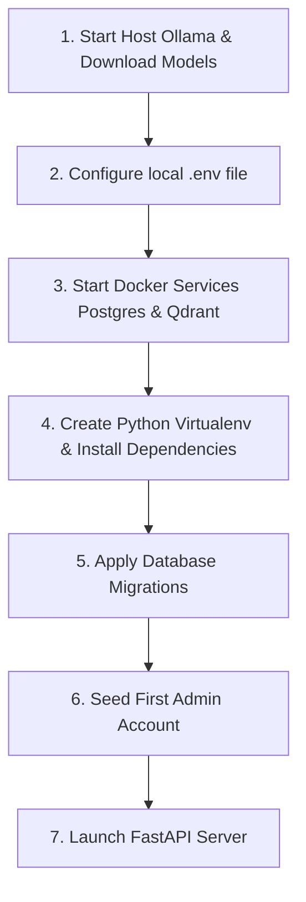

# 04. Startup Sequence

This document defines the step-by-step commands and startup order to run the baseline RAG pipeline locally on **macOS (M2, 8 GB RAM)**.

---

## 1. Startup Order Lifecycle



---

## 2. Execution Command Log

### Step 1: Start Ollama and Download Models
1. Launch the Ollama App on your Mac (runs native menu bar icon).
2. Open terminal and run:
   ```bash
   ollama pull llama3
   ollama pull nomic-embed-text
   ```
3. Verify Ollama is ready:
   ```bash
   curl http://localhost:11434/api/tags
   ```

### Step 2: Configure Environment Variables
Copy the local environment config to your backend:
```bash
cp template/{{cookiecutter.project_slug}}/backend/.env.example backend/.env
```
Open `backend/.env` and replace it with the values from **`02_REQUIRED_ENV.md`** (Option A: Host Run).

### Step 3: Start Postgres and Qdrant in Docker
Start **only** the necessary services in the background:
```bash
docker compose up -d db qdrant
```
Verify they are running:
```bash
docker compose ps
```

### Step 4: Install Python Dependencies locally
Use `uv` to create a virtual environment and sync packages:
```bash
uv venv
source .venv/bin/activate
uv sync
```

### Step 5: Apply Alembic Migrations
Run DB upgrades to configure the database schema (create tables: users, organizations, etc.):
```bash
uv run alembic upgrade head
```

### Step 6: Seed Admin User Account
Create the initial administrator account in PostgreSQL:
```bash
uv run cli/commands.py user create-admin --email admin@example.com --password admin123
```

### Step 7: Launch FastAPI Server
Start Uvicorn with hot-reload enabled:
```bash
uv run uvicorn app.main:app --host 127.0.0.1 --port 8000 --reload
```
Open [http://localhost:8000/docs](http://localhost:8000/docs) in your browser to verify API swagger access.

---

## 3. Potential Blockers & Troubleshooting

1. **Blocker: "Port already in use"**
   * *Resolution:* Run `lsof -i :5432` or `lsof -i :6333` and kill the host process ID (`kill -9 PID`) before starting docker compose.
2. **Blocker: "Ollama connection refused"**
   * *Resolution:* Check if Ollama app is open. If you run the backend inside Docker, verify `OLLAMA_BASE_URL` is set to `http://host.docker.internal:11434`, not `http://localhost:11434`.
3. **Blocker: "Out of memory / Docker VM Crash"**
   * *Resolution:* Reduce Docker Desktop RAM memory limit to 2 GB in Docker settings.
