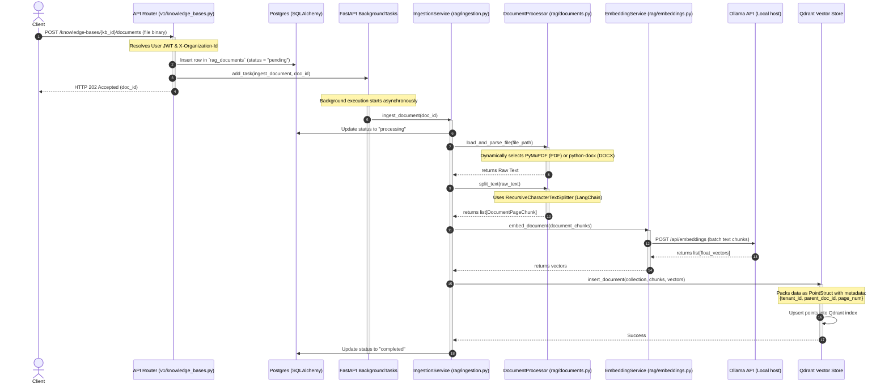
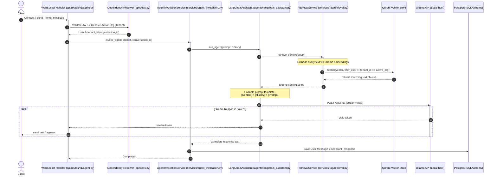

# Code Execution Flows

This document traces the exact step-by-step code execution flows for the two primary operations in the **rag-pipeline** application: **Document Ingestion** and **RAG Chat Retrieval**.

---

## 1. Document Ingestion Flow (Asynchronous local parsing & index)

This sequence outlines the execution flow when a user uploads a PDF or DOCX file to a Knowledge Base.

### Detailed Trace:
1. **Trigger:** The client uploads a file through `POST /api/v1/knowledge-bases/{kb_id}/documents`.
2. **Authorization & Validation:** The API router resolves the user context and verifies they belong to the organization matching the KB tenant context via `get_active_organization` dependency.
3. **Database Registry:** A new record is written to the PostgreSQL table `rag_documents` with status `"pending"`.
4. **Task Scheduling:** FastAPI's `BackgroundTasks.add_task` registers `IngestionService.ingest_document()`, freeing the HTTP worker thread.
5. **Immediate Response:** HTTP `202 Accepted` is returned with the document ID.
6. **Task Run:** In the background thread, the status is changed to `"processing"`.
7. **Document Extraction:** `DocumentProcessor` checks the mime type. If it's a PDF, it parses it using `pymupdf`. If it's a DOCX, it parses it using `python-docx`.
8. **Text Chunking:** Text is split using `RecursiveCharacterTextSplitter` into overlapping segments, compiling chunk metadata (`page_num`, `source_path`, `tenant_id`).
9. **Embedding Generation:** Chunks are sent to the local Ollama embeddings model, returning vector arrays.
10. **Vector Ingestion:** `QdrantVectorStore.insert_document()` groups vectors and text payloads into `PointStruct` entries, inserting them into Qdrant.
11. **State Update:** The database record in PostgreSQL is set to `"completed"`. (On failure, set to `"failed"`).

---

## 2. RAG Chat Retrieval Flow (Semantic Prompt Query)

This sequence outlines the execution flow when a user queries the AI Agent to get answers grounded in their Knowledge Base.

### Detailed Trace:
1. **Trigger:** The client establishes a WebSocket connection to `/api/v1/agent/chat` and sends a prompt payload.
2. **Context Resolution:** The JWT is extracted from the connection headers (or cookies) and checked. The tenant context (`tenant_id`/`organization_id`) is retrieved using `get_active_organization`.
3. **Agent Invocation:** `AgentInvocationService.invoke_agent()` is called.
4. **Retrieval Action:** The assistant invokes `RetrievalService.retrieve_context()`.
5. **Embedding Query:** The user's query is converted to a vector embedding by calling the local Ollama embedding engine.
6. **Isolated Vector Search:** A query is dispatched to the local Qdrant instance. It forces a hard partition query filter:
   `Filter(must=[FieldCondition(key="tenant_id", match=MatchValue(value=tenant_id))])`
   This ensures that no points belonging to other tenants are checked.
7. **Similarity Response:** Qdrant returns matching text blocks.
8. **Prompt Compiling:** Retrieved text chunks and chat history from Postgres are mapped into the LangChain system prompt template.
9. **Model Streaming:** The system calls the Ollama Chat API (`/api/chat`).
10. **Token Push:** The tokens generated by the local LLM are streamed back to the router and pushed to the client WebSocket.
11. **History Persistence:** Once generation completes, the final prompt and answer are committed to the PostgreSQL `messages` table under the corresponding `conversation_id`.
