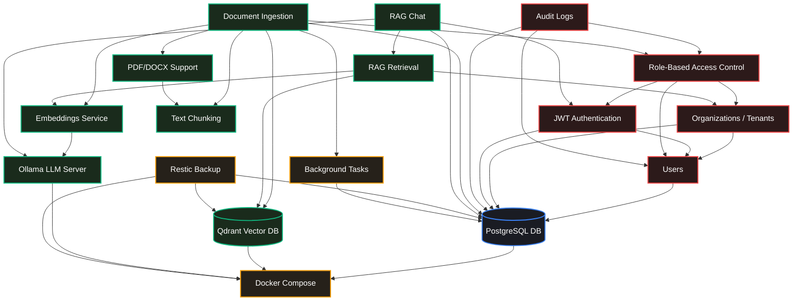

# Feature Dependency Graph

This document models the functional dependencies, lifecycle connections, and relational boundaries between the core features in the **rag-pipeline** application.

---

## 1. Feature Dependency Diagram (Mermaid)

The diagram below maps how features depend on one another. The arrows point from the dependent feature to the feature it requires (e.g., `JWT Authentication` requires `PostgreSQL` and `Users`).

---

## 2. Granular Dependency Matrix

Here is the structured trace detailing what each feature requires and which subsequent capabilities it supports.

### PostgreSQL
* **Depends On:** Docker Compose (environment orchestrator).
* **Used By:** Users, Organizations, JWT Authentication, Audit Logs, Document Ingestion (metadata status tracking), Chat (history persistence), Background Tasks (state validation).
* **Can be safely disabled?** No. PostgreSQL is the master database for state persistence.

### Users
* **Depends On:** PostgreSQL.
* **Used By:** Organizations, JWT Authentication, RBAC, Audit Logs.
* **Can be safely disabled?** No. Baseline user records are mandatory.

### Organizations (Tenants)
* **Depends On:** PostgreSQL, Users.
* **Used By:** RBAC, RAG Retrieval (used for isolated query filtering), Audit Logs, Knowledge Base.
* **Can be safely disabled?** No. In a multi-tenant setup, this defines the partition keys.

### JWT Authentication
* **Depends On:** Users, PostgreSQL.
* **Used By:** RBAC, Document Ingestion, Knowledge Base, RAG Chat, Audit Logs.
* **Can be safely disabled?** No. Necessary to secure endpoints.

### Role-Based Access Control (RBAC)
* **Depends On:** JWT Authentication, Organizations, Users.
* **Used By:** Document Ingestion, Knowledge Base, RAG Chat, Audit Logs.
* **Can be safely disabled?** No. Governs endpoint security permissions.

### Document Ingestion
* **Depends On:** FastAPI Background Tasks, PostgreSQL, PDF/DOCX Support, Chunking, Embeddings, Qdrant, RBAC.
* **Used By:** Knowledge Base.
* **Can be safely disabled?** No. Ingestion is required to feed files into the RAG model.

### PDF/DOCX Support
* **Depends On:** PyMuPDF, python-docx python packages.
* **Used By:** Document Ingestion, Chunking.
* **Can be safely disabled?** No. Needed to parse documents.

### Chunking
* **Depends On:** `langchain-text-splitters` library.
* **Used By:** Document Ingestion.
* **Can be safely disabled?** No. Splitting text is essential for LLM contexts.

### Embeddings
* **Depends On:** Ollama.
* **Used By:** Document Ingestion, Qdrant, RAG Retrieval.
* **Can be safely disabled?** No. Needed to query vector database.

### Qdrant
* **Depends On:** Docker Compose.
* **Used By:** Document Ingestion, RAG Retrieval, Restic Backup.
* **Can be safely disabled?** No. The core vector storage system.

### RAG Retrieval
* **Depends On:** Qdrant, Embeddings, Organizations (for tenant isolation).
* **Used By:** RAG Chat.
* **Can be safely disabled?** No. Necessary to fetch relevant document context.

### RAG Chat
* **Depends On:** Retrieval, Ollama, PostgreSQL, JWT Authentication.
* **Used By:** Client Applications.
* **Can be safely disabled?** No. Main prompt interface.

### Audit Logs
* **Depends On:** PostgreSQL, Users, RBAC.
* **Used By:** Security Auditing.
* **Can be safely disabled?** Yes. Can be turned off by setting `enable_teams=false` or disabling log triggers.

### Background Tasks
* **Depends On:** FastAPI.
* **Used By:** Document Ingestion.
* **Can be safely disabled?** No. Required to run document processing asynchronously.

### Restic Backup
* **Depends On:** Docker Compose, PostgreSQL (database volumes), Qdrant (database volumes).
* **Used By:** Local Backups.
* **Can be safely disabled?** Yes. Backups are operations-related rather than core RAG features.
