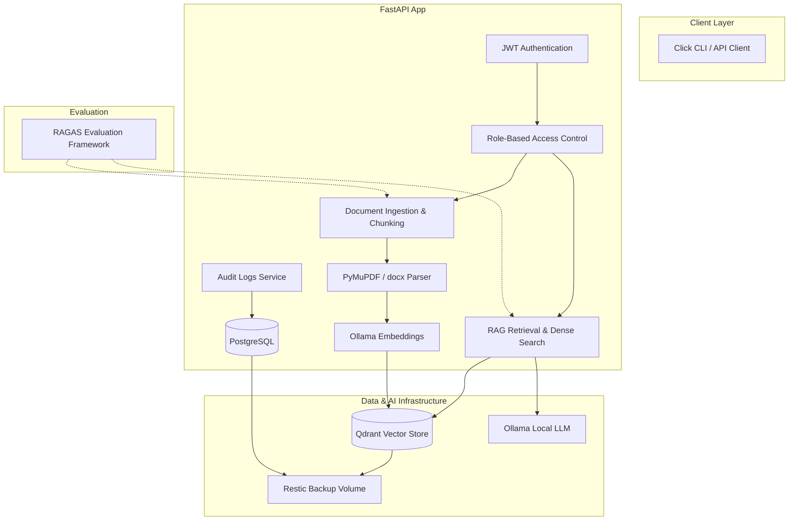

# Project Scope Document

This document outlines the fixed architecture, boundary guidelines, and functional requirements for the **rag-pipeline** project. It delineates which components of the repository are **In-Scope** (to be kept and integrated) and which are **Out-of-Scope** (to be removed or disabled).

---

## 1. Project Goal & Core Architecture
The goal of this project is to build a secure, multi-tenant Document Ingestion and Retrieval-Augmented Generation (RAG) pipeline running entirely on local infrastructure. 

---

## 2. In-Scope Technology Stack (The Fixed Scope)

The codebase must be pruned down to support only the following technologies and features, running locally inside **Docker Compose**:

### Core Backend & Services
* **FastAPI:** Core web framework for APIs and endpoints.
* **PostgreSQL:** Primary database to store user authentication state, organizational membership (tenants), system roles, and audit logs.
* **Docker Compose:** Multi-container configuration to orchestrate all services locally (FastAPI, Qdrant, Ollama, PostgreSQL, Restic).

### AI & Retrieval (LangChain + Ollama + Qdrant)
* **LangChain:** Unified framework for local LLM integration, token chunking, prompting, and vector database interaction.
* **Ollama:** Local model provider hosting the LLM (e.g., `llama3` or `mistral`) and embeddings.
* **Qdrant:** Vector database dedicated to storing document embeddings and executing semantic queries.
* **Document Ingestion (PDF/DOCX):** Local ingestion system utilizing **PyMuPDF** (for PDF extraction) and **python-docx** (for Microsoft Word documents).
* **Chunking & Embeddings:** Recursive text splitting with semantic chunk metadata. Employs local Ollama embedding endpoints (or offline `sentence-transformers`).
* **RAG Retrieval:** Dense semantic lookup querying Qdrant, integrating `tenant_id` filtering.

### Security, Multi-Tenancy & Governance
* **JWT Authentication:** Strict token-based authentication (access/refresh tokens) generated and verified by the backend. No third-party OAuth provider.
* **tenant_id Filtering:** Complete logical data isolation. The database `organization_id` acts as the `tenant_id`. Every document ingest and vector query must append a `tenant_id` filter (metadata payload in Qdrant) to enforce separation.
* **RBAC (Role-Based Access Control):** 
  * *System Level:* Superusers/Admins (`UserRole.ADMIN`) and regular Users (`UserRole.USER`).
  * *Tenant/Org Level:* Owners, Admins, Members, and Viewers (`OrgRole`).
* **Confidentiality:** Hard tenant boundaries at the API request and database query levels. System secrets are injected only via local `.env`.
* **Audit Logs:** Database auditing of administrative actions (e.g., users added/removed, collections created/deleted, backups triggered) using the `AppAdminAuditLog` model.

### New Features (Evaluation & Backups)
* **RAGAS (RAG Assessment):** Evaluation framework using LangChain + Ollama to benchmark search precision, faithfulness, and answer relevance.
* **Restic Backup:** Local backup runner to create encrypted snapshot backups of PostgreSQL database volumes and Qdrant storage directories to a local mount.

---

## 3. Out-of-Scope (To Be Removed / Excluded)

The following components and files represent features that are **not** part of the fixed project scope and must be deactivated, stubbed, or deleted in the final setup:

### Frontend
* **Next.js Frontend (`frontend/`):** Out of scope. The API is headless, controlled via Click CLI scripts or direct HTTP requests.

### Cloud Integrations & External APIs
* **SaaS LLM APIs:** Direct configurations for OpenAI, Anthropic, Gemini, or OpenRouter are removed. Ollama is the sole LLM backend.
* **S3/Google Drive Sync:** External document connectors and background sync sources (`google-api-client`, `boto3`) are excluded. Ingestion is local-only.
* **Observability Cloud APIs:** Logfire, LangSmith, and Sentry configurations are removed in favor of local standard console logs and Docker monitoring.
* **Stripe Billing:** Stripe client code, subscription webhooks, plans, and credits systems are stripped out.

### Alternative Frameworks & Libraries
* **PydanticAI, PydanticDeep, LangGraph, DeepAgents:** Removed. Only LangChain is used for orchestration.
* **Milvus, ChromaDB, pgvector:** Removed. Qdrant is the sole vector database.
* **Background Task Queues:** Celery, Taskiq, Arq, and Prefect, along with their Redis broker dependencies, are removed. FastAPI's built-in in-process `BackgroundTasks` is utilized for asynchronous ingestion to maintain a lightweight local stack.
* **Chatbot Integrations:** Slack and Telegram SDKs and webhooks are removed.

---

## 4. Key Architectural Decisions for Scope Reduction

1. **In-Process Task Processing:** Standard document ingestion is handled asynchronously via FastAPI's native `BackgroundTasks` instead of spawning separate worker containers (Celery/Taskiq/Flower) which run up local RAM usage.
2. **Tenant ID Mapping:** The database model `Organization` is kept to represent a logical Tenant. All tables containing tenant data (conversations, knowledge bases, ingested documents) maintain a foreign key to `organizations.id` (mapped as `tenant_id`). Qdrant metadata schema includes `tenant_id` to enforce hard partition queries.
3. **Local-Only LLM & Embeddings:** The system uses `langchain-community`'s `OllamaEmbeddings` and `Ollama` (or `ChatOllama`) class pointing to `http://ollama:11434` in the Docker Compose network.
4. **Local Backup Automation:** Restic will run inside a scheduled Docker container, mounting the PostgreSQL and Qdrant volume directories, encrypting snapshots, and saving them to a backup folder mounted on the host machine.
5. **Offline Evaluations:** RAGAS runs as a batch CLI task or API utility, invoking local Ollama models (e.g. `llama3` for labeling, `mxbai-embed-large` for embeddings) to evaluate stored query-response logs.
