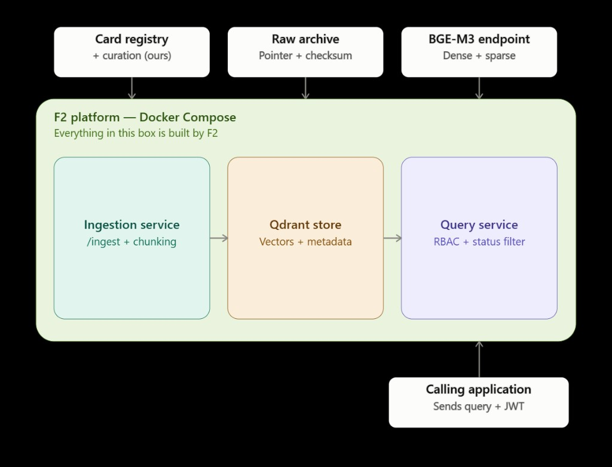
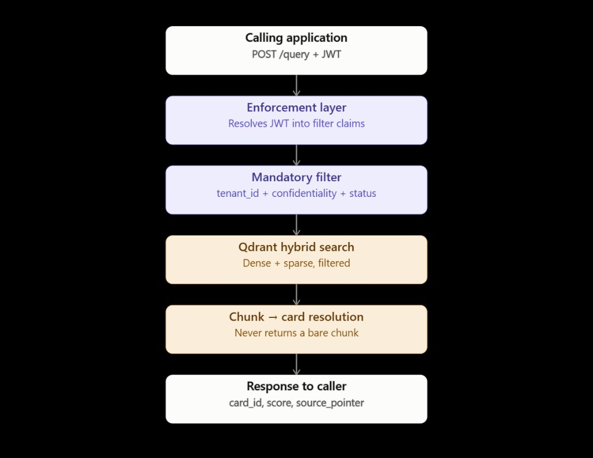

# F2 Platform Design Document

**Knowledge Card Retrieval Layer — Architecture, Metadata Schema & RBAC Filter Design**

---

## 1. Architecture

### 1.1 Overview

The F2 retrieval layer stores, embeds, and retrieves **Knowledge Cards** — atomic, versioned, approvable units of knowledge (decisions, lessons, processes, known issues, prompts, document records).

**F2 owns:** Qdrant deployment, `/ingest` and `/query` endpoints, chunking, BGE-M3 hybrid embeddings, RBAC/tenant/status filtering, and audit logging.

**Out of scope:** PostgreSQL card registry, raw archive storage, knowledge agents, and identity provider (Authentik JWT claims are consumed, not built).

### 1.2 Platform Architecture

The platform runs in Docker Compose. External data sources feed ingestion; calling applications query via JWT-authenticated `POST /query`.



| Component | Responsibility |
|-----------|----------------|
| **Card Registry** (external) | Source of truth for `card_id`, lifecycle, versions, and relationships |
| **Raw Archive** (external) | Immutable original files; F2 records `source_pointer` + `source_checksum` |
| **BGE-M3 Endpoint** (external) | Dense (1024-dim) + sparse embeddings |
| **Ingestion Service** (F2) | Parse, chunk, embed, upsert to Qdrant (idempotent per `card_id`) |
| **Qdrant Store** (F2) | Vectors + security-relevant metadata payload |
| **Query Service** (F2) | RBAC + status filters, hybrid search, chunk-to-card resolution |
| **Calling Application** (external) | Sends query + JWT; receives `card_id`, `score`, `source_pointer` |

### 1.3 Deployment

| Service | Image | Role |
|---------|-------|------|
| `app` | FastAPI backend | `/ingest`, `/query`, RBAC enforcement |
| `db` | PostgreSQL 16 | Document tracking (`rag_documents`) |
| `qdrant` | Qdrant v1.18 | Multi-vector store (dense + sparse) |

### 1.4 Data Flows

**Ingestion:** Caller supplies card payload + file → parse (PDF/DOCX) → embed via BGE-M3 → upsert to Qdrant. Default: one card = one point. Oversized sources are chunked (300–700 tokens, 10–20% overlap) with `is_chunk`, `parent_card_id`, `chunk_index`.

**Query:**



1. JWT resolved to filter claims (tenant, role, user)
2. Mandatory filters applied: `tenant_id` + `confidentiality` + `status`
3. Qdrant hybrid search (dense + sparse, RRF fusion)
4. Chunk hits resolved to parent cards — bare chunks are never returned
5. Response: `card_id`, `score`, `source_pointer`

### 1.5 PostgreSQL vs Qdrant

| System | Role |
|--------|------|
| **PostgreSQL** | System of record — full content, version history, relationships |
| **Qdrant** | Search index — embeddings + access-control metadata subset |

Security fields are duplicated into Qdrant so filtering happens inside the vector search, not post-retrieval. The link between systems is `card_id` (always issued by the registry, never by F2).

### 1.6 API Contracts

**`POST /ingest`** — File or text + full card payload. Parse, chunk, embed, upsert. Idempotent per `card_id`.

**`POST /query`** — Query text + optional filters (`type`, `area`, `project`, `tags`, etc.). Mandatory RBAC filters always applied server-side.

Response per result: `card_id`, `title`, `type`, `status`, `version`, `score`, `matched_text`, `source_pointer`.

---

## 2. Metadata Schema Design

### 2.1 Qdrant Payload

| Field | Type | Filterable | Notes |
|-------|------|:----------:|-------|
| `card_id` | uuid | yes | Canonical identity from registry |
| `tenant_id` | uuid | **mandatory** | Tenant isolation |
| `type` | keyword | yes | Card type (lookup list) |
| `status` | keyword | **mandatory** | `draft` / `proposed` / `approved` / `superseded` / `obsolete` / `archived` |
| `version` | integer | yes | Current version number |
| `area` | keyword | yes | Business area; determines collection |
| `project` | keyword | yes | Project or venture |
| `tags` | keyword[] | yes | Free-form tags |
| `confidence` | keyword | yes | `high` / `medium` / `low` |
| `confidentiality` | keyword | **mandatory** | Access control, deny-by-default |
| `owner` | keyword | yes | Knowledge owner (user ID) |
| `language` | keyword | yes | Content language |
| `permissions` | keyword | yes | `public` / `read` / `write` / `member` / `viewer` |
| `source_pointer` | text | no | URI to raw archive |
| `source_checksum` | text | no | Checksum at ingestion |
| `document_id` | uuid | yes | Lineage identifier |
| `is_chunk` | bool | yes | `true` for sub-chunks |
| `parent_card_id` | uuid | yes | Parent card for chunks |
| `chunk_index` | integer | yes | Position within parent |

All filterable fields have Qdrant payload indexes created at collection setup.

### 2.2 Status & Versioning

Default queries return **`approved`** cards only. Other statuses require Admin/Owner role with explicit `status_filter`.

Cards sharing a `document_id` form a lineage. Newest version is current; prior versions become `superseded`. Version history lives in PostgreSQL.

### 2.3 Card Types

`Project` · `Process` · `Decision` · `Lesson Learned` · `Best Practice` · `Workflow` · `Prompt` · `System/Tool` · `Document` · `Known Issue` · `Glossary/Rule`

Card relationships (`depends_on`, `supersedes`, etc.) are stored in PostgreSQL, not Qdrant.

---

## 3. RBAC Filter Design

### 3.1 Principles

- Every query passes through a shared enforcement layer — no unfiltered path exists
- Filters are Qdrant `must` conditions applied **before** search, not after
- Deny by default: missing `tenant_id` → deny all; high confidentiality → owner only
- Role/tenant/user values come from authenticated JWT (Authentik), never from the request body

### 3.2 Mandatory Filters

Applied on every query regardless of caller input:

| Filter | Default condition |
|--------|-------------------|
| **Tenant** | `metadata.tenant_id == <jwt.tenant_id>` |
| **Status** | `metadata.status IN ["approved"]` |
| **Confidentiality** | `confidentiality IN [low, medium, public]` OR `owner == current_user_id` |

### 3.3 Role Matrix

| Role | Permissions filter | Confidentiality | Status override |
|------|-------------------|-----------------|-----------------|
| **viewer** | `viewer`, `read`, `public` | High → owner only | No |
| **member** | + `member`, `member-only` | High → owner only | No |
| **admin** | Bypassed | High → owner only | Yes |
| **owner** | Bypassed | Bypassed | Yes |

### 3.4 Filter Construction

```python
must_conditions = [
    FieldCondition(key="metadata.tenant_id", match=MatchValue(value=tenant_id)),
    FieldCondition(key="metadata.status", match=MatchAny(any=allowed_statuses)),
]
# Role-based permissions (viewer/member only)
# Confidentiality should-block (non-owner roles)
return Filter(must=must_conditions)
```

### 3.5 Query Pipeline

```
POST /query + JWT
  → Extract tenant_id, role, user_id from JWT
  → Build Qdrant Filter (mandatory + optional caller filters)
  → Hybrid search with filter applied
  → Resolve chunks to parent cards
  → Return card_id, score, source_pointer
```

Optional caller filters (`type`, `area`, `project`, `tags`, `confidence`, `owner`, `language`) are appended as additional `must` conditions on top of the mandatory set.
