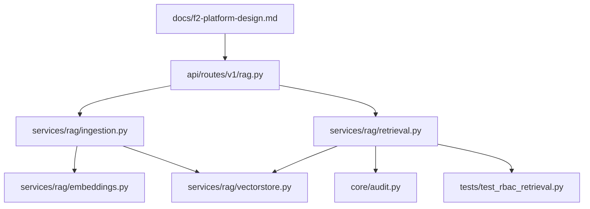

# Requirements Gap Analysis Guide

Comparison of this repository against Schedule A milestones and regulations in [`rag doc.docx`](../rag%20doc.docx) (Knowledge Base / RAG Retrieval Layer — F2 AI Core).

Related docs (not duplicated here):

- Design intent: [`f2-platform-design.md`](f2-platform-design.md)
- Implementation notes: [`../backend/docs/knowledge_cards.md`](../backend/docs/knowledge_cards.md)
- Run / Swagger walkthrough: [`../RAG_PIPELINE_GUIDE.md`](../RAG_PIPELINE_GUIDE.md)
- Project overview: [`../README.md`](../README.md)

---

## 1. Scope snapshot

**Contract scope (Schedule A):** a retrieval layer that stores, embeds, and queries Knowledge Cards in Qdrant with mandatory tenant/RBAC/confidentiality filters, audit logging, RAGAS evaluation, restic backups, and handoff docs.

**What F2 is supposed to own** (per design doc):

| Owned by F2 | Out of scope (external) |
|-------------|-------------------------|
| Qdrant deployment | Card registry (source of truth for `card_id`) |
| `/ingest` and `/query` | Raw archive storage |
| Chunking + BGE-M3 hybrid embeddings | Identity provider (Authentik JWT claims consumed, not built) |
| RBAC / tenant / status filtering | Knowledge agents |
| Access-decision audit logging | |

**What this repo actually is:** the F2 retrieval layer **plus** a full FastAPI application template (orgs, JWT auth, conversations, agents, knowledge-base CRUD, sync-source scaffolding). Treat template features as extras unless Schedule A explicitly requires them.

---

## 2. Milestone checklist (M1–M6)

| Milestone | Status | What exists | Gaps |
|-----------|--------|-------------|------|
| **M1** Architecture & setup | **Done** | [`docker-compose.yml`](../docker-compose.yml): `app`, Postgres 16, Qdrant v1.18; Knowledge Card metadata on `RAGDocument` including `tenant_id`; RBAC filter design implemented in code | Design assumed Authentik JWT claims; runtime uses local JWT + org context |
| **M2** Vector store, ingest, embedding | **Done** (path naming differs) | Qdrant named vectors `dense` + `sparse`, payload indexes; `POST /api/v1/rag/collections/{name}/ingest/card`; BGE-M3 client in [`embeddings.py`](../backend/app/services/rag/embeddings.py); idempotent purge via `delete_card(card_id)` before upsert | Contract said `/ingest`; code uses nested collection path. BGE-M3 falls back to OpenAI dense + mock sparse when `BGEM3_ENDPOINT_URL` is empty |
| **M3** RBAC, tenant & query API | **Mostly done** | Server-side filters for `tenant_id`, role/permissions, ownership, public; JWT auth; `POST /api/v1/rag/query` returns citations with `score`, `card_id`, `source_pointer` | Tenant resolved from active org (`X-Organization-Id` / personal org), not Authentik claims. Agent KB tool skips tenant/role args |
| **M4** Confidentiality & evaluation | **Mostly done** | High confidentiality deny-by-default for non-owners; `record_audit` on `/search` and `/query`; `rag-evaluate` CLI (real RAGAS or similarity fallback) | Audits record allow decisions + policy metadata, not per-document deny reasons; no standalone “evaluation report” artifact beyond CLI stdout |
| **M5** Backups & testing | **Partial** | `rag-backup` CLI; unit tests for filter construction and card ingest | No scheduled restic jobs; default repo path is a local absolute path; if restic is missing, checks are **simulated**. Cross-tenant RAG HTTP E2E is weak (isolation tests lean toward conversations / filter unit tests) |
| **M6** Documentation & handoff | **Mostly done** | Compose, README, design docs, knowledge-cards notes, Swagger runbook | No formal client walkthrough / handover checklist; NDA-style process items live outside code |

### Milestone evidence map

```
M1  docker-compose.yml
    backend/app/db/models/rag_document.py
    backend/app/services/rag/retrieval.py  (_build_security_filter)

M2  backend/app/services/rag/vectorstore.py
    backend/app/services/rag/ingestion.py  (ingest_card, delete_card)
    backend/app/services/rag/embeddings.py (BGEM3EmbeddingProvider)
    backend/app/api/routes/v1/rag.py       (POST .../ingest/card)

M3  backend/app/api/routes/v1/rag.py       (POST /search, POST /query)
    backend/app/api/deps.py                (JWT, ActiveOrg)
    backend/app/services/rag/retrieval.py

M4  retrieval.py confidentiality should-block
    backend/app/core/audit.py
    backend/app/commands/rag_evaluate.py

M5  backend/app/commands/rag_backup.py
    backend/tests/test_rbac_retrieval.py
    backend/tests/test_ingestion.py
    backend/tests/test_tenant_isolation.py

M6  README.md, docs/f2-platform-design.md, RAG_PIPELINE_GUIDE.md,
    backend/docs/knowledge_cards.md
```

---

## 3. Regulations (§1–§16)

Regulations fall into two buckets: **code-enforceable** vs **process/policy**. Process items cannot be “implemented” as features; they need operational confirmation.

### 3.1 Code-enforceable

| § | Requirement | Status | Notes |
|---|-------------|--------|-------|
| **4** Tenant isolation | **Mostly done** | `metadata.tenant_id` is a mandatory Qdrant `must` condition. Missing tenant → deny-all sentinel. HTTP `/search` and `/query` pass `tenant_id=str(active_org.id)`. Callers cannot set tenant via request body filters (only type/area/project/tags/etc.). **Gap:** agent tool `search_knowledge_base` does not pass tenant/role |
| **5** RBAC & confidentiality | **Mostly done** | Viewer/member permission arrays; admin bypasses permissions; owner bypasses permissions + confidentiality; high confidentiality restricted to owner (non-owner roles). Enforced in Qdrant filter before search | Confirm org-admin vs design-doc “admin” naming matches client expectations |
| **6** Mandatory security filters | **Mostly done** on HTTP paths | Tenant + status (`approved` default) + confidentiality always applied in `_build_security_filter`. Optional caller filters are additive, not replacements | Same agent-path caveat as §4 |
| **7** Audit logging | **Partial** | Persists to `AppAdminAuditLog` with actor, org, action (`rag_retrieval_search` / `rag_retrieval_query`), collection, role, tenant, status filter, result count. Does **not** log raw query text or chunk contents (good for confidentiality) | Always logs `"decision": "allow"` after filtered search; does not log explicit deny events or why a specific card was excluded |
| **10** Source traceability | **Done** on `/query` | Citations include `card_id`, `score`, `source_pointer`, plus filename/page where present | Matches Schedule A “source + score”; design also wanted title/type/status/version — several of those are present on the citation schema when payload has them |

### 3.2 Process / policy (not code features)

| § | Requirement | How this repo relates |
|---|-------------|------------------------|
| **1** Client data stays in approved environments | Operational — do not copy client KB content to personal storage or unapproved clouds |
| **2** No unapproved AI/third-party tools | **Technical flag:** `/query` sends retrieved chunk **content** to the configured LLM (`OPENAI_API_KEY` / `OPENAI_API_BASE`, e.g. Groq). BGE-M3 endpoint and any cloud embeddings are also third-party paths. Approve these before production client data |
| **3** No unauthorized disclosure / subcontracting | Process / NDA |
| **8** Credentials & secrets | Secrets via `.env` / env vars (not committed). Least-privilege is operational. **Code smell:** `rag-backup` default `-r` path is a developer machine absolute path — override in real use |
| **9** GDPR / personal data | Same as §2: external LLM/embedding calls process retrieval text. Flag architecture if client forbids that |
| **11** Backups & copies | Restic is the approved mechanism per contract; CLI exists but scheduled jobs + proven restore are incomplete (see M5) |
| **12** No reuse of client-specific work | Process |
| **13** Third-party / OSS disclosure | Stack includes FastAPI, Qdrant, PostgreSQL, LangChain, OpenAI-compatible clients, RAGAS, restic — disclose as required |
| **14** Portfolio / public disclosure | Process — no client approval, no public demos |
| **15** Security incident (24h) | Process — confirm NDA reporting path with team |
| **16** Final handover | Process — return/destroy client data; strip confidential content from docs |

### 3.3 Notable technical risks

1. **Agent RAG bypass** — [`backend/app/agents/tools/rag_tool.py`](../backend/app/agents/tools/rag_tool.py) calls `retrieve` / `retrieve_multi` without `tenant_id` or `role`. Missing tenant triggers deny-all in `_build_security_filter`, so agent search may return nothing rather than leaking — but it is **not** RBAC-parity with HTTP and is unsafe if that deny-default behavior ever changes.
2. **LLM grounding on `/query`** — Retrieved text leaves the boundary to whatever model `AI_MODEL` + API base point at. Approve or disable for confidential corpora (§2/§9).
3. **BGE-M3 fallback** — Without `BGEM3_ENDPOINT_URL`, dense may come from OpenAI provider and sparse from a local hash/mock. Fine for local demos; not production embedding fidelity for M2.
4. **Audit “allow-only”** — Satisfies “log access decisions” weakly; does not fully answer “why access was denied” for excluded cards (§7).

---

## 4. Extra vs missing

### 4.1 Extra (beyond Schedule A)

These are useful but not required by the milestone list:

| Area | Where |
|------|--------|
| Full multi-tenant app (orgs, members, roles) | `backend/app/db/models/organization*.py`, deps |
| Conversations + AI agents | `backend/app/agents/`, conversation routes |
| Knowledge Base CRUD scopes (personal/org/app) | `/api/v1/kb`, `services/knowledge_base.py` |
| File upload ingest (PDF/DOCX/MD/TXT), not only cards | `POST .../ingest`, background worker |
| Local directory sync + sync-source CRUD framework | `services/rag_sync.py`, `services/sync_source.py` |
| Empty connector registry (API mentions Drive/S3) | `services/rag/connectors/__init__.py` → `CONNECTOR_REGISTRY = {}` |
| OpenAI embedding path alongside BGE-M3 | `embeddings.py` |
| Swagger-oriented runbook | `RAG_PIPELINE_GUIDE.md` |
| Reranker scaffold (disabled) | `services/rag/reranker.py` |

### 4.2 Missing or incomplete relative to contract + design

| Item | Detail |
|------|--------|
| Authentik JWT claim consumption | Local JWT + `ActiveOrg`; design doc expected IdP claims for tenant/role/user |
| Bare `/ingest` and `/query` paths | Implemented under `/api/v1/rag/...` with collection segments for ingest |
| Scheduled restic backup jobs | CLI check only; simulated when binary missing |
| Tested restore evidence | Dry-run when restic present; otherwise mocked success |
| Strong HTTP E2E: tenant A cannot retrieve tenant B | Filter unit tests exist; full API cross-tenant RAG scenario is thin |
| Deny-path / rich audit | Allow-centric audit details |
| Agent path RBAC parity | Tool omits tenant/role |
| Concrete sync connectors | Framework only; registry empty |
| `CHANNEL_ENCRYPTION_KEY` for sync secrets | Referenced by sync crypto helpers; confirm Settings wiring before relying on encrypted connector configs |

---

## 5. How to understand the code

### 5.1 Mental model

```
Caller (JWT + optional X-Organization-Id)
        │
        ▼
  FastAPI /api/v1/rag
        │
        ├─ ingest/card ──► IngestionService ──► EmbeddingService ──► Qdrant upsert
        │                      │                      │
        │                      └─ Postgres rag_documents (tracking + card metadata)
        │
        └─ search / query ──► RetrievalService._build_security_filter
                                    │
                                    ▼
                              Qdrant hybrid search (dense + sparse, RRF)
                                    │
                                    ├─ /search  → chunks + scores
                                    └─ /query   → chunks → LLM answer + citations
                                         │
                                         └─ record_audit(...)
```

- **PostgreSQL** = system of record / ingest tracking (`rag_documents`, orgs, audit logs).
- **Qdrant** = search index (vectors + security-relevant payload). Link key: `card_id`.

### 5.2 Recommended reading order

1. **Contract intent** — [`docs/f2-platform-design.md`](f2-platform-design.md) (architecture, payload schema, RBAC matrix).
2. **HTTP surface** — [`backend/app/api/routes/v1/rag.py`](../backend/app/api/routes/v1/rag.py): start with `ingest_card`, `search_documents`, `query_knowledge_base`.
3. **Ingest pipeline** — [`ingestion.py`](../backend/app/services/rag/ingestion.py) → [`documents.py`](../backend/app/services/rag/documents.py) (parse/chunk) → [`embeddings.py`](../backend/app/services/rag/embeddings.py) → [`vectorstore.py`](../backend/app/services/rag/vectorstore.py).
4. **Security** — [`retrieval.py`](../backend/app/services/rag/retrieval.py) `_build_security_filter` (this is the heart of M3/M4), then [`core/audit.py`](../backend/app/core/audit.py).
5. **Auth context** — [`api/deps.py`](../backend/app/api/deps.py) (`CurrentUser`, `ActiveOrg`, admin gates).
6. **Ops** — CLI under `backend/app/commands/rag.py`, `rag_evaluate.py`, `rag_backup.py`; compose at repo root.
7. **Proof** — [`test_rbac_retrieval.py`](../backend/tests/test_rbac_retrieval.py), [`test_ingestion.py`](../backend/tests/test_ingestion.py).

### 5.3 Flow diagram



### 5.4 Key symbols to search for

| Concept | Symbol / string |
|---------|-----------------|
| Mandatory filters | `_build_security_filter` |
| Card idempotency | `delete_card`, `ingest_card` |
| Hybrid search | `FusionQuery`, `Fusion.RRF`, Prefetch |
| Tenant deny-default | `DENY_ALL` |
| Audit | `record_audit`, `rag_retrieval_query` |
| BGE-M3 | `BGEM3EmbeddingProvider`, `BGEM3_ENDPOINT_URL` |
| Agent gap | `search_knowledge_base` |

### 5.5 Hands-on path

To exercise the implemented Schedule A slice without reading everything: follow [`RAG_PIPELINE_GUIDE.md`](../RAG_PIPELINE_GUIDE.md) (compose → migrate → seed → Swagger authorize → create collection → ingest card → query). Prefer `card_status=approved` and `confidentiality=public` so retrieval filters do not hide your own test data.

---

## 6. Bottom line

| Category | Verdict |
|----------|---------|
| Core retrieval milestones M1–M4 | Largely implemented in this codebase |
| M5 backups / E2E tenant proof | Partial — needs operational restic + stronger HTTP isolation tests |
| M6 handoff | Docs exist; formal client walkthrough checklist incomplete |
| Regulations §4–6, §10 on HTTP RAG | Enforced server-side with documented caveats |
| Regulations §7 | Present but allow-centric |
| Regulations §1–3, §8–9, §11–16 | Mostly process; §2/§9 conflict risk via external LLM/embeddings |
| Template extras | Orgs, agents, KB CRUD, sync scaffolding — do not confuse with Schedule A completion |

When unsure whether something is “done for F2,” ask: *Does it live on the HTTP ingest/query path with Qdrant filters and audit?* If yes, it is in scope. If it is only agents, sync connectors, or simulated backups, treat it as extra or incomplete.
